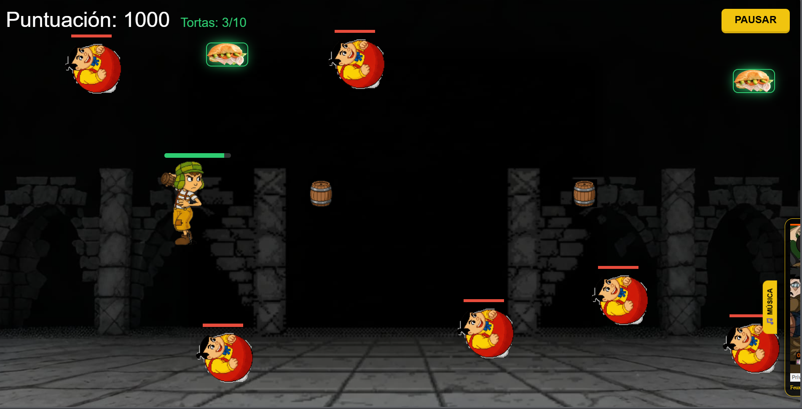

# ChavoGame

Bienvenido a **ChavoGame**, un ''juego de naves arcade'' desarrollado mediante el concepto de **Vibe Coding**, priorizando la iteración rápida y una experiencia de usuario fluida.

## Tecnologías Empleadas

- **HTML5**: Estructura semántica y contenedores del juego.
- **CSS3 (Vanilla)**: Diseño moderno con animaciones suaves, filtros de iluminación (`drop-shadow`) y transiciones interactivas.
- **JavaScript (ES6+)**:
  - **Módulos**: Organización de código desacoplada.
  - **Programación Orientada a Objetos (OOP)**: Clases para naves, enemigos y consumibles.
  - **Capa de Protección**: Uso de campos privados (`#`) y cierres (IIFE) para evitar trampas en la consola.

## Estructura del Proyecto

El código está organizado de forma modular para facilitar el mantenimiento y la escalabilidad:

- **`/` (Raíz)**: `index.html` centraliza la interfaz.
- **`/css/`**: `style.css` contiene toda la magia visual y animaciones.
- **`/js/`**:
  - `main.js`: Punto de entrada que inicializa los bucles del juego bajo una capa protectora.
  - `Personaje.js`: Lógica del jugador (movimiento, disparo, gestión de vida y sistema de puntuación).
  - `Enemigo.js`: Comportamiento de los obstáculos y enemigos.
  - `Consumible.js`: Lógica de la "Torta" (Power-up).
  - `constants.js`: Estado global del juego (`gameState`) y listas de objetos.
  - `helpers.js`: Funciones de utilidad para crear elementos, gestionar tiempos y mostrar pantallas (Game Over, Pausa, Victoria).
  - `colisiones.js`: Motor de detección de colisiones basado en rectángulos con soporte para "padding".

## Mecánicas y Características

### Sistema de Colisiones "Forgiving"

El juego implementa hitboxes que "perdonan": el área de choque es ligeramente más pequeña que la imagen visual, permitiendo esquivas mucho más ajustadas y satisfactorias, es menos tilteante.

### Pantallas Dinámicas

El sistema de menús se refactorizó para ser genérico:

- **Pausa**: Permite detener la acción y reanudar sin perder el progreso.
- **Game Over**: Aparece cuando la vida llega a 0.
- **Victoria**: Se activa al alcanzar **10,000 puntos** o recolectar **10 tortas**.

### Power-ups: La Torta

Un objeto codiciado que otorga recompensas dobles:

- Recupera **20 HP** (hasta un máximo de 100).
- Otorga **250 puntos** de bonificación.
- Identificable por su brillo verde esmeralda.

### Música Interactiva

Integración con SoundCloud que se oculta inteligentemente en una esquina y se despliega suavemente al pasar el ratón, permitiendo controlar la ambientación sin interrumpir el juego.

## El Proceso: Vibe Coding & Co-Creación

Este juego no fue simplemente "programado", fue **diseñado a través del diálogo** osea vibe coding pues. mi desempeño fue el de un **Arquitecto de Producto y Diseñador Jefe** es decir:

### Mis Decisiones Clave

1. **Refactorización Modular**: MI visión fue separar el código en archivos distintos para tener un proyecto profesional y organizado.
2. **Equilibrio de Dificultad**: Decidi que las colisiones directas **restaran puntos (-50)** en lugar de darlos, incentivando el uso de disparos "tácticos".
3. **Condiciones de Victoria Duplicadas**: Elegi dar al jugador dos caminos (Puntos o Recolección de Tortas).
4. **Seguridad ITFA**: Basico creo yo, la necesidad de proteger el código, lo que me llevó a implementar campos privados (`#`) para que nadie pueda trucar su puntuación o vida desde la consola del navegador.
5. **Estética**: Cada elección visual (brillos verdes, barras de vida dinámicas, animaciones de pausa) fue guiada por mi búsqueda de una interfaz que no fuera taaan "básica".

## Reflexión Final: El Poder del Prompt Engineering

En resumen, este proyecto ha sido un ejercicio de agilización y optimización. He volcado mis conocimientos técnicos previos, potenciándolos al máximo mediante el uso estratégico de la Inteligencia Artificial. He comprobado que, cuando tienes claros los fundamentos y sabes articular tus peticiones (**Prompt Engineering**), el flujo de trabajo se vuelve exponencialmente más fluido.

Este proceso no solo ha resultado en un juego funcional, sino que ha sido la plataforma perfecta para perfeccionar el arte de "hablarle" a la máquina y maximizar el potencial de la co-creación.
